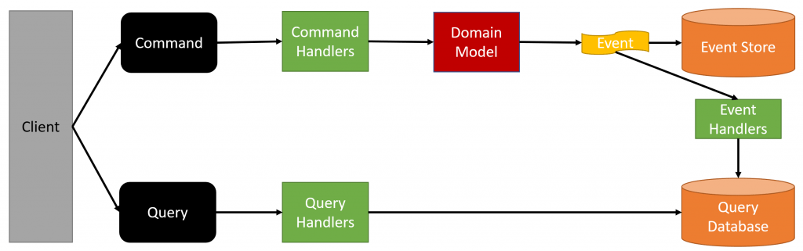

# vgt-saga-orders

Main repository of the saga process.
Contains both orders microservice and orchestrator

[Database, CQRS and Event Sourcing described bellow.](#db)

[SAGA transaction flow described bellow.](#saga)

## Repository

This repository contains additional submodules containing shared libraries of the SAGA microservices implementations.

To update those submodules in the local branch run:

    git submodule update --remote --merge

## Configuration

### Environmental variables

- RABBIT_HOST -> Address of the rabbit server.
- RABBIT_VIRT_HOST -> Virtual host of the rabbit server.
- RABBIT_PORT -> Port of the rabbit server.
- RABBIT_USR -> Username to log in with.
- RABBIT_PASSWORD -> User password to log in with.
- BACKEND_REQUESTS -> Queue name of the requests from the backend.
- BACKEND_REPLIES -> Exchange name to publish finished sagas to.
- RABBIT_REPLIES -> Queue of the replies sent back to the orchestrator.
- RABBIT_ORDER -> Queue of the requests sent by the orchestrator to the order service.
- RABBIT_PAYMENT -> Queue of the requests sent by the orchestrator to the payment gate service.
- RABBIT_HOTEL -> Queue of the requests sent by the orchestrator to the hotel service.
- RABBIT_FLIGHT -> Queue of the requests sent by the orchestrator to the flight service.
- DB_SERVER -> Database server name to use
- DB_NAME_SAGA -> Database name to use for the order service and the orchestrator
- DB_PASSWORD -> Database password to use for the database server
- DB_USER -> Username to use for the database server

## Implementation documentation
XML docs of the project available in the repository in the
file [SagaOrdersDocumentation.xml](SagaOrdersDocumentation.xml)

# <a name="db">Data storage (PostgreSQL)</a>

Follows CQRS and Event Sourcing.

Read Database of the CQRS consists of the one main table:
Transactions -> contains current information about each SAGA transaction with its SAGA state, 
answers from the services and the information on the trip parts.

Event store is organised with the NEventStore C# library and has the following integration with CQRS:

# <a name="saga">SAGA transaction flow</a>

The flow schema specifies doesn't mention orchestrator for better clarity of the flow. Orchestrator is present in all comunications between those stages.

SAGA transaction begins in the Order service, which creates the database entity of the Transaction with the data recieved from the backend. 
If no transaction for the specified offer is currently ongoing then the SAGA transaction is started and the request is passed to the orchestrator.

Orchestrator saves events concerning the transaction to the event store and passes the request to Hotel and Flight services simulatnously for temporary booking.

If Flight temporary booking transaction failes then the orchestrator will send out rollback request to the hotel service.
If Hotel temporary booking transaction failes then the orchestrator will send out rollback request to the flight service.
If both fail then the orchestrator will send out failure of the transaction to the Order Service.
If both pass then the orchestrator will send out a request to the payment service.

Payment service randomizes time of the response and the response, returnes payment accepted or declined.

If the payment failed then the orchestrator will send out rollback requests to the hotel and flight services.
If the payment is successfull then the orchestrator will send out full booking requests to the hotel and flight services. From now on, failures won't be rolled back.

If any of the services returnes failure then the orchestrator will pass failure to the Order service to end the transaction.
If Both are successful then the orchestrator will pass acceptance of the transaction to the Order service to end the transaction.

